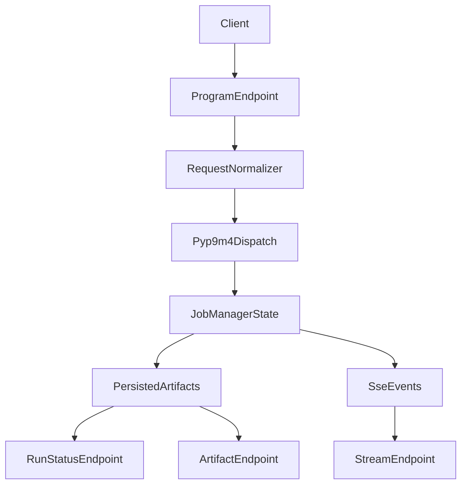

# Full pyp9m4-Orchestrated API Simplification

## Goals

- Replace bespoke orchestration glue with `pyp9m4`'s current API-oriented surface (`arun`, tool normalization/dispatch, JSON-ready envelopes, managed background jobs/snapshots).
- Keep the FastAPI service clear and predictable: one request path for launch, one for status, one for artifacts/stream, and explicit run lifecycle behavior.
- Update dependency constraints so the `p9m4_gui` conda environment and backend runtime reliably use a compatible `pyp9m4` version.

## Files to change

- [C:/Users/u28409265/Documents/Prover9-Mace4-Web/prover9-mace4-api/pyp9m4_runner.py](C:/Users/u28409265/Documents/Prover9-Mace4-Web/prover9-mace4-api/pyp9m4_runner.py)
- [C:/Users/u28409265/Documents/Prover9-Mace4-Web/prover9-mace4-api/delivery_manager.py](C:/Users/u28409265/Documents/Prover9-Mace4-Web/prover9-mace4-api/delivery_manager.py)
- [C:/Users/u28409265/Documents/Prover9-Mace4-Web/prover9-mace4-api/api_server.py](C:/Users/u28409265/Documents/Prover9-Mace4-Web/prover9-mace4-api/api_server.py)
- [C:/Users/u28409265/Documents/Prover9-Mace4-Web/prover9-mace4-api/p9m4_types.py](C:/Users/u28409265/Documents/Prover9-Mace4-Web/prover9-mace4-api/p9m4_types.py)
- [C:/Users/u28409265/Documents/Prover9-Mace4-Web/prover9-mace4-api/requirements.txt](C:/Users/u28409265/Documents/Prover9-Mace4-Web/prover9-mace4-api/requirements.txt)
- [C:/Users/u28409265/Documents/Prover9-Mace4-Web/prover9-mace4-api/Readme.md](C:/Users/u28409265/Documents/Prover9-Mace4-Web/prover9-mace4-api/Readme.md)
- [C:/Users/u28409265/Documents/Prover9-Mace4-Web/prover9-mace4-api/API_GUI_MIGRATION.md](C:/Users/u28409265/Documents/Prover9-Mace4-Web/prover9-mace4-api/API_GUI_MIGRATION.md)
- [C:/Users/u28409265/Documents/Prover9-Mace4-Web/prover9-mace4-api/tests/test_api.py](C:/Users/u28409265/Documents/Prover9-Mace4-Web/prover9-mace4-api/tests/test_api.py)

## Implementation steps

1. Rebuild the runner around top-level `pyp9m4` exports.
  - Move from submodule-specific imports and manual resolver/runner plumbing to package-level orchestration APIs.
  - Replace custom option extraction logic with `cli_options_from_nested_dict` and/or accepted mapping/dataclass pathways for each tool.
  - Normalize output using package-provided envelope/snapshot `.to_dict()` helpers instead of ad-hoc dictionaries.
2. Replace custom run-task bookkeeping with managed jobs.
  - Introduce `JobManager`-backed run creation/status/result retrieval in `delivery_manager`.
  - Represent API lifecycle from pyp9m4 snapshots directly (queued/running/succeeded/failed/timed_out/cancelled mapping), preserving current API fields where feasible.
  - Keep artifact persistence and chaining semantics, but source status/result data from pyp9m4 job state rather than internal task heuristics.
3. Redesign API endpoints around a unified orchestration flow.
  - Keep program-specific launch endpoints but route all launches through one orchestration function that uses normalized tool names.
  - Align status and artifact endpoints with managed job state and structured result payloads (including parsed/model payloads where available).
  - Ensure stream mode emits consistent events from the same canonical run state transitions.
4. Tighten request/response models.
  - Update `p9m4_types` to reflect new canonical lifecycle/outcome vocabulary and avoid stale legacy process-only fields.
  - Deprecate or remove unsupported aliases (for example `ISOFILTER2` if not exposed as distinct behavior).
  - Keep chained-input provenance (`source_run_id`, `source_artifact`) and validation guarantees.
5. Update dependency policy and environment guidance.
  - Set a minimum `pyp9m4` version in `requirements.txt` that includes the orchestration APIs used by this refactor.
  - Add explicit `p9m4_gui` conda commands in README for upgrade/verification (activate env, upgrade `pyp9m4`, confirm installed version, reinstall backend deps).
6. Refresh docs and migration notes.
  - Update backend README endpoint behavior and expected payload examples to match new managed orchestration behavior.
  - Update `API_GUI_MIGRATION.md` where run status/artifacts/stream semantics change.
7. Verify with tests.
  - Update API tests for new orchestration shapes and lifecycle semantics.
  - Add/adjust tests for: launch+status happy path, failure propagation, cancel behavior, persisted artifact retrieval, and stream completion behavior.

## Data-flow target

## Validation checklist

- API starts with updated `pyp9m4` minimum version installed.
- Launch endpoints return accepted metadata and valid `run_id` references.
- Status transitions reflect managed job snapshots through terminal states.
- Persisted artifacts and chained-input runs work for Prover9/Mace4 and transformation tools.
- Stream mode produces terminal `completed`/`error` semantics and closes cleanly.
- README commands work in `p9m4_gui` conda env end-to-end.

