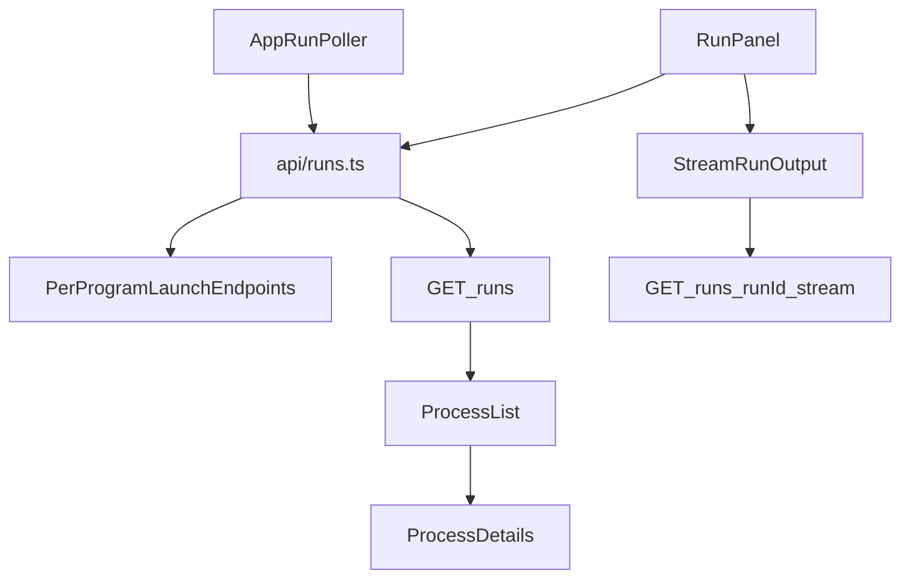

# GUI Knock-on Fixes For Simplified API

## Scope

Bring the GUI into full contract alignment with the updated API server (`/runs` + per-program launch routes), focusing on behavioral mismatches and stale legacy naming/types that can cause runtime confusion or edge-case failures.

## Findings Driving This Plan

- GUI still contains legacy process-era naming/types and enum members that no longer match intended contracts (for example `ISOFILTER2`, `ProcessState`, `ProgramInput`) in [C:/Users/u28409265/Documents/Prover9-Mace4-Web/prover9-mace4-gui/src/types.ts](C:/Users/u28409265/Documents/Prover9-Mace4-Web/prover9-mace4-gui/src/types.ts).
- `RunPanel` performs direct `fetch` launches instead of consistently using typed API client helpers in [C:/Users/u28409265/Documents/Prover9-Mace4-Web/prover9-mace4-gui/src/components/RunPanel.tsx](C:/Users/u28409265/Documents/Prover9-Mace4-Web/prover9-mace4-gui/src/components/RunPanel.tsx).
- `App` also does direct run-list fetches instead of the shared API client, fragmenting error handling and response assumptions in [C:/Users/u28409265/Documents/Prover9-Mace4-Web/prover9-mace4-gui/src/App.tsx](C:/Users/u28409265/Documents/Prover9-Mace4-Web/prover9-mace4-gui/src/App.tsx).
- UI text and labels still reference “process” in many places despite run-based behavior, increasing operator confusion in [C:/Users/u28409265/Documents/Prover9-Mace4-Web/prover9-mace4-gui/src/components/ProcessList.tsx](C:/Users/u28409265/Documents/Prover9-Mace4-Web/prover9-mace4-gui/src/components/ProcessList.tsx) and [C:/Users/u28409265/Documents/Prover9-Mace4-Web/prover9-mace4-gui/src/components/ProcessDetails.tsx](C:/Users/u28409265/Documents/Prover9-Mace4-Web/prover9-mace4-gui/src/components/ProcessDetails.tsx).
- Lifecycle handling is mostly compatible now, but status/event handling should be hardened for alias/forward-compatible values (`completed`, `succeeded`, `timed_out`) used during/after migration.

## Implementation Plan

1. **Harden and clean shared frontend contracts**
  - Update [C:/Users/u28409265/Documents/Prover9-Mace4-Web/prover9-mace4-gui/src/types.ts](C:/Users/u28409265/Documents/Prover9-Mace4-Web/prover9-mace4-gui/src/types.ts) to remove stale process-era exported types that are no longer used in run-based flows.
  - Remove/deprecate `ISOFILTER2` from GUI-facing enum usage to match current route surface.
  - Tighten lifecycle typing and helpers for badge/render logic so unknown statuses degrade safely.
2. **Consolidate all run API calls through `src/api/runs.ts`**
  - Refactor [C:/Users/u28409265/Documents/Prover9-Mace4-Web/prover9-mace4-gui/src/App.tsx](C:/Users/u28409265/Documents/Prover9-Mace4-Web/prover9-mace4-gui/src/App.tsx) to use `listRuns(...)` for polling.
  - Refactor [C:/Users/u28409265/Documents/Prover9-Mace4-Web/prover9-mace4-gui/src/components/RunPanel.tsx](C:/Users/u28409265/Documents/Prover9-Mace4-Web/prover9-mace4-gui/src/components/RunPanel.tsx) to use `launchProver9(...)` / `launchMace4(...)` helper functions.
  - Keep parse/generate_input/sample endpoints as direct calls (not part of run client) but normalize error parsing and messages.
3. **Fix UI knock-on behavior and naming consistency**
  - Update visible labels/messages from “process” to “run” where the semantics are now run-centric.
  - In run list/details, ensure action availability and badge colors correctly cover `queued`, `running`, `completed`, `failed`, `cancelled`, and fallback values.
  - Keep stream-run behavior but improve completion/error handling to remain robust if event/lifecycle strings vary.
4. **Regression-proof with focused tests**
  - Update [C:/Users/u28409265/Documents/Prover9-Mace4-Web/prover9-mace4-gui/src/App.test.tsx](C:/Users/u28409265/Documents/Prover9-Mace4-Web/prover9-mace4-gui/src/App.test.tsx) and any affected component tests to reflect shared API client usage and run terminology.
  - Add/adjust tests for:
    - run list polling path (`/runs`)
    - launch success path for persisted/stream acknowledgements
    - stream registration/removal behavior
    - tolerant lifecycle rendering for alias values.
5. **Verify locally in GUI project**
  - Run GUI test suite and fix any introduced TypeScript/test errors.
  - Smoke-check launch + status + details + stream output against current backend behavior.

## Data-flow Check (Post-fix)

## Files Expected To Change

- [C:/Users/u28409265/Documents/Prover9-Mace4-Web/prover9-mace4-gui/src/types.ts](C:/Users/u28409265/Documents/Prover9-Mace4-Web/prover9-mace4-gui/src/types.ts)
- [C:/Users/u28409265/Documents/Prover9-Mace4-Web/prover9-mace4-gui/src/api/runs.ts](C:/Users/u28409265/Documents/Prover9-Mace4-Web/prover9-mace4-gui/src/api/runs.ts)
- [C:/Users/u28409265/Documents/Prover9-Mace4-Web/prover9-mace4-gui/src/App.tsx](C:/Users/u28409265/Documents/Prover9-Mace4-Web/prover9-mace4-gui/src/App.tsx)
- [C:/Users/u28409265/Documents/Prover9-Mace4-Web/prover9-mace4-gui/src/components/RunPanel.tsx](C:/Users/u28409265/Documents/Prover9-Mace4-Web/prover9-mace4-gui/src/components/RunPanel.tsx)
- [C:/Users/u28409265/Documents/Prover9-Mace4-Web/prover9-mace4-gui/src/components/ProcessList.tsx](C:/Users/u28409265/Documents/Prover9-Mace4-Web/prover9-mace4-gui/src/components/ProcessList.tsx)
- [C:/Users/u28409265/Documents/Prover9-Mace4-Web/prover9-mace4-gui/src/components/ProcessDetails.tsx](C:/Users/u28409265/Documents/Prover9-Mace4-Web/prover9-mace4-gui/src/components/ProcessDetails.tsx)
- [C:/Users/u28409265/Documents/Prover9-Mace4-Web/prover9-mace4-gui/src/components/StreamRunOutput.tsx](C:/Users/u28409265/Documents/Prover9-Mace4-Web/prover9-mace4-gui/src/components/StreamRunOutput.tsx)
- [C:/Users/u28409265/Documents/Prover9-Mace4-Web/prover9-mace4-gui/src/App.test.tsx](C:/Users/u28409265/Documents/Prover9-Mace4-Web/prover9-mace4-gui/src/App.test.tsx)

