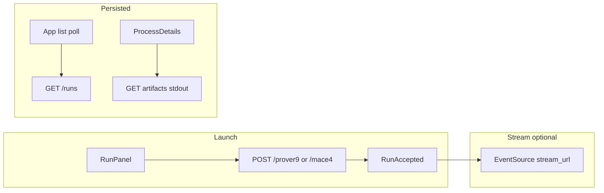

# GUI migration to new run-based API

## Current gap

The React app still targets endpoints that no longer exist. Confirmed usages:

| Location                                                                  | Legacy                                                             | Implemented                                                                                                                                  |
| ------------------------------------------------------------------------- | ------------------------------------------------------------------ | -------------------------------------------------------------------------------------------------------------------------------------------- |
| [App.tsx](prover9-mace4-gui/src/App.tsx)                                  | `GET /processes`, `GET /status/{id}`                               | `GET /runs` returns full `[RunSummary](prover9-mace4-api/p9m4_types.py)` objects (no second round-trip needed)                               |
| [RunPanel.tsx](prover9-mace4-gui/src/components/RunPanel.tsx)             | `POST /start`, `POST /save_input`                                  | `POST /prover9`, `POST /mace4`; remove or replace save (no server route)                                                                     |
| [ProcessList.tsx](prover9-mace4-gui/src/components/ProcessList.tsx)       | `kill`, `pause`, `resume`, `DELETE /process/{id}`                  | `POST /runs/{run_id}/cancel`, `DELETE /runs/{run_id}`; drop pause/resume ([API_GUI_MIGRATION.md](prover9-mace4-api/API_GUI_MIGRATION.md))    |
| [ProcessDetails.tsx](prover9-mace4-gui/src/components/ProcessDetails.tsx) | `GET /output/{id}`, `GET /download/{id}`, `POST /start` for chains | `GET /runs/{run_id}/artifacts/{artifact}`, `GET /runs/{run_id}/download/{artifact}`, per-program POST with `input.kind === "process_output"` |

Backend contracts worth matching exactly:

- `[ProgramRunRequestV2](prover9-mace4-api/p9m4_types.py)`: `input` (tagged union), optional `name`, optional `options` dict (JSON-serializable primitives), `delivery_mode` (`persisted` | `stream`).
- `[RunAccepted](prover9-mace4-api/p9m4_types.py)`: `run_id`, `program`, `delivery_mode`, `lifecycle`, `created_at`, optional `stream_url` (relative path like `/runs/.../stream`).
- `[list_runs](prover9-mace4-api/delivery_manager.py)` returns **persisted runs only**; stream-mode runs never appear in `GET /runs`.

## 1. Types ([types.ts](prover9-mace4-gui/src/types.ts))

- Add `DeliveryMode`, `InputKind`, discriminated unions for `TextInputSource`, `FileInputSource`, `ProcessOutputInputSource`, and `ProgramRunRequestV2` (or a GUI-facing alias) mirroring the Python models.
- Replace `Process` / numeric `id` with `RunSummary`-aligned fields: `run_id: string`, `lifecycle` (e.g. `queued` | `running` | `completed` | `failed` | `cancelled`), `delivery_mode`, `created_at`, optional `source_run_id` / `source_artifact` / `error`.
- Add `RunAccepted`, artifact response shape `{ run_id, artifact, content }`, and a minimal `StreamEvent` / SSE parse target (event name + JSON `data` from `[StreamEvent](prover9-mace4-api/p9m4_types.py)`).
- Keep existing GUI option panels’ types (`Prover9Options`, `Mace4Options`, etc.); request bodies still pass `options` as a **plain dict** compatible with `[Pyp9m4Runner.map_*_options](prover9-mace4-api/pyp9m4_runner.py)` (nested `IntegerParameter` objects with `.value` are handled via `_extract_option_value`).
- Deprecate or remove `ProgramType.ISOFILTER2` in the GUI unless mapped to `POST /isofilter` (no dedicated route in backend).

## 2. Small API layer (new file, e.g. `src/api/runs.ts` or `src/apiClient.ts`)

Centralize fetch helpers: `listRuns`, `getRunStatus`, `getArtifact`, `downloadArtifact`, `cancelRun`, `deleteRun`, `launchProver9`, `launchMace4`, `launchProoftrans`, `launchInterpformat`, `launchIsofilter`, each taking `baseUrl` and returning typed JSON. This keeps components thin and matches the migration doc’s “API client wiring”.

## 3. Request builders ([RunPanel.tsx](prover9-mace4-gui/src/components/RunPanel.tsx))

- After `generate_input`, build `input: { kind: "text", text }`.
- `POST` to `/prover9` or `/mace4` with `name`, `delivery_mode` (user control: toggle or select; default `persisted` for simplest parity with list/history).
- Pass `options` from existing contexts (same structure as today’s implicit `/start` body fields, flattened into one dict per runner expectations).
- On success: parse `RunAccepted`; if `delivery_mode === "stream"` and `stream_url` is set, optionally open SSE (see step 6) and call `refreshProcesses` if provided via new prop.
- Remove `POST /save_input` (no backend) — replace with client-only save (download blob / `localStorage`) or drop the button; do not leave a dead fetch.

## 4. App state ([App.tsx](prover9-mace4-gui/src/App.tsx))

- `selectedProcess: number | null` → `selectedRunId: string | null`.
- `updateProcessList`: single `GET /runs`, map JSON to `RunSummary[]`; remove N× `GET /status`.
- Polling interval can remain for list refresh; optionally poll `GET /runs/{id}/status` only for the selected run if finer updates are needed.
- Pass `refreshProcesses` into `RunPanel` so new launches refresh the list.
- For **stream-mode** runs not listed on the server: keep an optional `activeStreamRuns: { runId, program, streamUrl }[]` in state when launching with stream mode, merge into UI or show a dismissible banner — otherwise stream-only runs disappear from history (per `[list_runs` filter](prover9-mace4-api/delivery_manager.py)).

## 5. Process list ([ProcessList.tsx](prover9-mace4-gui/src/components/ProcessList.tsx))

- Row key and selection: `run_id` (string).
- Status badges: map `lifecycle` strings (`running`, `completed`, `failed`, `cancelled`, `queued`, …) instead of old `ProcessState` enum where they differ.
- Actions: **Cancel** when `lifecycle === "running"` → `POST .../cancel`; **Remove** → `DELETE .../runs/{run_id}`; remove Pause/Resume/Kill naming in favor of Cancel per new API.
- Display `delivery_mode`, and if `source_run_id` is set, show a short provenance hint (e.g. “from run …”).

## 6. Process details ([ProcessDetails.tsx](prover9-mace4-gui/src/components/ProcessDetails.tsx))

- Props: `runId: string | null`, `runs: RunSummary[]`.
- Replace paginated `GET /output` with loading `stdout` (and optionally `stderr`) via `GET .../artifacts/stdout` or `GET .../artifacts/{artifact}`; drop infinite scroll unless you reintroduce client-side chunking of large strings.
- Polling: while `lifecycle === "running"`, poll `getRunStatus` and/or re-fetch `stdout` artifact.
- Download: `GET .../download/stdout` (or chosen artifact) — matches `[download_run_artifact](prover9-mace4-api/api_server.py)`.
- **Chained tools** (Translate / Format / Filter): replace `input: processId` with `input: { kind: "process_output", run_id: <selected string>, artifact: "stdout" }` (verify mace4: if interpretation input should be another artifact such as serialized models, adjust after testing; start with `stdout` consistent with subprocess tools).
- Build `options` dicts aligned with `[map_prooftrans_options` / `map_interpformat_options` / `map_isofilter_options](prover9-mace4-api/pyp9m4_runner.py)` (flat `format`, booleans, etc.).
- On successful child run `RunAccepted`, call parent `refreshProcesses` (new prop) so the new run appears in the table.

## 7. Stream mode UI (final slice per migration doc)

- Use `EventSource` on `new URL(stream_url, apiUrl)` (resolve relative `stream_url` against configured API base).
- Append stdout/stderr/model lines to a buffer or structured log; handle `completed` / `error` / `end` to close subscription.
- Only needed if the user selects stream delivery in RunPanel; can ship persisted-only first, then SSE.

## 8. Tests and samples

- Update [App.test.tsx](prover9-mace4-gui/src/App.test.tsx) mocks if they assert old routes.
- Sample tree: [RunPanel](prover9-mace4-gui/src/components/RunPanel.tsx) already uses `GET /samples` + static mount; keep `fetch(\`${apiUrl}/samples/${path})`consistent with`StaticFiles`under`/samples`.

## Verification (manual)

- Launch Prover9 and Mace4 (persisted): appear in list, stdout visible, download works.
- Cancel a running job; delete a completed job.
- From a completed Prover9 run, run Prooftrans; from Mace4, Interpformat / Isofilter; confirm new rows and artifacts.
- Optional: stream mode shows live output via SSE.

## Notes

- **Options typing**: Backend currently uses a single `ProgramRunRequestV2.options: Dict` ([p9m4_types.py](prover9-mace4-api/p9m4_types.py)), not separate Pydantic models per program; the GUI can still use small builder functions per program for clarity without waiting for backend split types.
- `**/generate_input` / `/parse`**: Unchanged; keep existing behavior.

