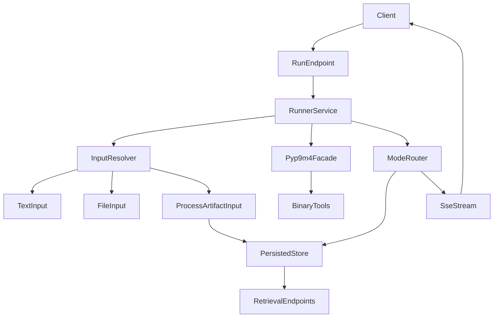

# pyp9m4 Async API + Endpoint Redesign Plan

## Scope and target

- Replace subprocess/file-based execution with `pyp9m4` async facades (`arun`, `amodels`, and async job handles where needed) as the single binary interface.
- Replace generic `/start` API with explicit per-program endpoints so options are transparent in typed request bodies.
- Provide two output delivery modes:
  - `persisted`: store run state/output on server for later retrieval.
  - `stream`: emit output/events live without durable output files.
- Remove old generic endpoints (breaking change requested).

Reference package: [pyp9m4 repo](https://github.com/jamiewannenburg/pyp9m4)

## Backend changes

- Refactor API routes in [C:/Users/u28409265/Documents/Prover9-Mace4-Web/prover9-mace4-api/api_server.py](C:/Users/u28409265/Documents/Prover9-Mace4-Web/prover9-mace4-api/api_server.py):
  - Add program-specific route groups, e.g.:
    - `POST /prover9`
    - `POST /mace4`
    - `POST /prooftrans`
    - `POST /interpformat`
    - `POST /isofilter`
  - Add result access routes split by mode:
    - persisted: list/status/output/download/delete
    - stream: subscription endpoint (SSE selected by agent decision)
- Introduce a `pyp9m4` runner service module (new file, e.g. `pyp9m4_runner.py`) that:
  - maps request models to `pyp9m4.options.*CliOptions` dataclasses.
  - uses async APIs for execution (`arun`/`amodels` and async handles for background).
  - normalizes tool outputs into API response models.
- Replace file/shelve-oriented process lifecycle in [C:/Users/u28409265/Documents/Prover9-Mace4-Web/prover9-mace4-api/process_handler.py](C:/Users/u28409265/Documents/Prover9-Mace4-Web/prover9-mace4-api/process_handler.py) with an in-memory + optional persisted-job store abstraction:
  - persisted mode: retain metadata + output text/model payload in storage.
  - stream mode: keep only ephemeral run state and stream chunks/events.
- Update schemas in [C:/Users/u28409265/Documents/Prover9-Mace4-Web/prover9-mace4-api/p9m4_types.py](C:/Users/u28409265/Documents/Prover9-Mace4-Web/prover9-mace4-api/p9m4_types.py):
  - add per-program request models with explicit option fields.
  - add shared `delivery_mode` (`persisted` | `stream`).
  - add stream-event schemas and per-program result payloads.
- Dependency/config updates:
  - add `pyp9m4` dependency in backend project.
  - configure binary resolution env vars (`LADR_BIN_DIR` and optional `GITHUB_TOKEN/GH_TOKEN`) for server runtime.

## API contract design (transparent options)

- Each program endpoint accepts:
  - `input` as a tagged source union with explicit origin:
    - `kind: "text"` with inline `text`.
    - `kind: "file"` with a server file handle/reference (validated against allowed storage roots).
    - `kind: "process_output"` with `{ run_id, artifact }` where `artifact` can target `stdout`, `stderr`, `parsed`, or tool-specific payload segments.
  - `options` object matching that program’s CLI options one-to-one where feasible.
  - `delivery_mode`.
- Add an input resolver layer in the runner service to normalize all input kinds into concrete text/bytes before invoking `pyp9m4`.
- For chained runs (`kind: "process_output"`), require source run to be persisted and completed; return typed 4xx errors for missing run, unsupported artifact, or incompatible format.
- Response contract:
  - persisted mode: `{ run_id, program, lifecycle, outcome?, created_at }` + follow-up retrieval endpoints.
  - stream mode: immediate stream URL or direct SSE response with typed events (`started`, `stdout`, `stderr`, `model`, `completed`, `error`).
- Keep parse/generate helper endpoints (`/parse`, `/generate_input`) unless explicitly folded into program routes.

### Chained-input robustness rules

- Persisted store records structured artifacts per run (raw output + parsed payload + metadata) with stable artifact keys for downstream references.
- Introduce artifact compatibility checks by target program (example: `prooftrans` can consume `prover9` proof-oriented artifacts; `isofilter` consumes interpretation streams/text).
- Support optional transform hints in input reference (e.g. select nth model/proof block) with explicit defaults and validation.
- Include provenance metadata in run records (`input_origin`, `source_run_id`, `source_artifact`) for traceability and GUI display.

## Execution/data-flow

## GUI migration documentation deliverable

- Add a dedicated migration document (new file, e.g. `prover9-mace4-api/API_GUI_MIGRATION.md`) that includes:
  - endpoint mapping table (old -> new).
  - new request/response JSON examples for each program.
  - input source union examples (`text`, `file`, `process_output`) and chaining constraints.
  - delivery mode behavior and UI expectations.
  - phased frontend checklist by file.
- Document concrete GUI file changes in:
  - [C:/Users/u28409265/Documents/Prover9-Mace4-Web/prover9-mace4-gui/src/components/RunPanel.tsx](C:/Users/u28409265/Documents/Prover9-Mace4-Web/prover9-mace4-gui/src/components/RunPanel.tsx)
  - [C:/Users/u28409265/Documents/Prover9-Mace4-Web/prover9-mace4-gui/src/components/ProcessDetails.tsx](C:/Users/u28409265/Documents/Prover9-Mace4-Web/prover9-mace4-gui/src/components/ProcessDetails.tsx)
  - [C:/Users/u28409265/Documents/Prover9-Mace4-Web/prover9-mace4-gui/src/components/ProcessList.tsx](C:/Users/u28409265/Documents/Prover9-Mace4-Web/prover9-mace4-gui/src/components/ProcessList.tsx)
  - [C:/Users/u28409265/Documents/Prover9-Mace4-Web/prover9-mace4-gui/src/App.tsx](C:/Users/u28409265/Documents/Prover9-Mace4-Web/prover9-mace4-gui/src/App.tsx)
  - [C:/Users/u28409265/Documents/Prover9-Mace4-Web/prover9-mace4-gui/src/types.ts](C:/Users/u28409265/Documents/Prover9-Mace4-Web/prover9-mace4-gui/src/types.ts)

## Verification strategy

- Backend:
  - async integration tests per program endpoint (success/failure/timeout).
  - mode tests for persisted retrieval vs SSE stream completion.
- Frontend migration validation:
  - run launch for each program.
  - process-to-process chaining from persisted artifacts.
  - live stream rendering path.
  - persisted history retrieval/download path.
  - control actions (cancel/delete) behavior per mode.

